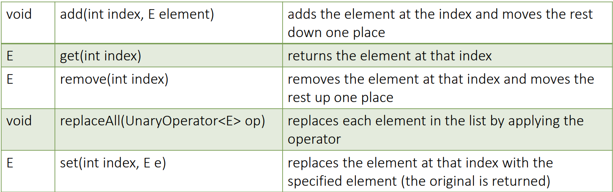

## Collections


- A **collection** is a group of objects contained in another object or data structure. 
- The **Collection** is the java.util.Collection interface from which List, Set and Queue extend. 
- The **Collections framework** is a group of classes in the java.util package for operating on collections. 
- There are 3 main interfaces in the collections framework: 
1. **List** :- A list is an ordered group of items that allows duplicate items. Items in a list are indexed, and the index starts from 0
2. **Set** :- a set is a group of elements that do now allow duplicate items
3. **Queue** :- A queue is a collection of elements that are stored in a FIFO order. 

- Map is not really part of the collections framework, since it does not implement the Collection interface. 
- The map above shows the collection interface and subsequent **Classes / Interfaces**

### Common Methods 
- Below is a list with the most common collection methods. 


### List 

 - List is an ordered collection. 
 - Each element in a list has an index 
 - List provides control over the elements in list using its index.
 - There are 3 common implementations of the list interface: 
1. **ArrayList** it is a resizable array, it can grow. It provides fast random access and fast iteration over its elements, but has slower insertion and deletion. 
2. **LinkedList** fast insertion and deletion, but slower iteration
3. **Stack** LIFO implementation. 

### Factory Methods 
 - There are 3 factory methods used to create list: 

#### Arrays.asList(array)
- Creates a list that is backed by the array. 
- You can modify the elements in the list
- You cannot remove/add elements to the list.

#### List.of(E....)
 - Create a list from a list of elements 
 - You cannot modify, delete or add items to the list. 

#### List.copyOf(Collection c)
- Create a list from the provided collection.
- You cannot modify, delete or add items to the list. 


### Creating ArrayList
- ArrayList has 3 public constructors that are used to create a list.
`````java
  var list1 = new ArrayList<String>();
  var list2 = new ArrayList<String>(list1); //From another list
  var list3 = new ArrayList<String>(10); //Pass a limit to the list
``````

### Common List Methods


### Creating LinkedList
`````java
var linked1 = new LinkedList<String>();
var linked2 = new LinkedList<String>(linked1);
``````
### Linked List Methods
LinkedList has the following additional methods:
**void addFirst(E e)**
 - Inserts the specified element at the front of this LinkedList if it is possible to do so immediately without violating capacity restrictions
 - throws an IllegalStateException if no space is currently available
 - if using a capacity restricted list, it is often better to use offerFirst()

**addLast(E e)**
- Inserts the specified element at the end of this LinkedList if it is possible to do so immediately without violating capacity restrictions
- throws an IllegalStateException if no space is currently available
- if using a capacity restricted list, it is often better to use offerLast()

**boolean offer(E e)**
- Inserts element at the tail(end) of the list, and returns true if the operation was successful. 


**boolean offerFirst(E e)**
- Inserts the specified element at the front of this deque unless it would violate capacity restrictions.
- When using a capacity-restricted deque, this method is generally preferable to the addFirst(E) method, which can fail to insert an element only by throwing an exception.
- Returns true is element was added to the queue, and false otherwise. 

**boolean offerLast(E e)**
- Inserts the specified element at the end of this deque unless it would violate capacity restrictions. 
- When using a capacity-restricted deque, this method is generally preferable to the addLast(E) method, which can fail to insert an element only by throwing an exception.
- Returns true is element was added to the queue, and false otherwise. 

**E remove()**
- Retrieves and removes the first element of this deque.
- Throws an exception if the list is empty. 

**E removeFirst()**
- Retrieves and removes the first element of this deque. 
- This method differs from pollFirst only in that it throws an exception if this LinkedList is empty.
- Throws NoSuchElementException - if this list is empty

**E removeLast()**
- Retrieves and removes the last element of this deque. 
- This method differs from pollLast only in that it throws an exception if this deque is empty.
- Throws NoSuchElementException - if this list is empty

**E pollFirst()**
Retrieves and removes the first element of this deque, or returns null if this deque is empty.

**E pollLast()**
Retrieves and removes the first element of this deque, or returns null if this deque is empty.


