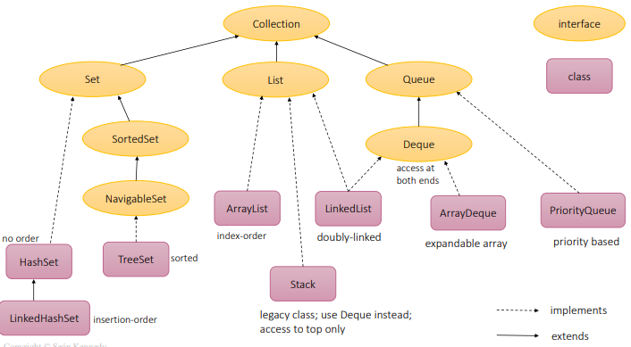

## Collections

- A **collection** is a group of objects contained in another object or data structure. 
- The **Collection** is the java.util.Collection interface from which List, Set and Queue extend. 
- The **Collections framework** is a group of classes in the java.util package for operating on collections. 
- There are 3 main interfaces in the collections framework: 
1. **List** :- A list is an ordered group of items that allows duplicate items. Items in a list are indexed, and the index starts from 0
2. **Set** :- a set is a group of elements that do now allow duplicate items
3. **Queue** :- A queue is a collection of elements that are stored in a FIFO order. 

- Map is not really part of the collections framework, since it does not implement the Collection interface. 
- The map above shows the collection interface and subsequent **Classes / Interfaces**

### Common Methods 
- Below is a list with the most common collection methods. 

### List 

 - List is an ordered collection. 
 - Each element in a list has an index 
 - List provides control over the elements in list using its index.
 - There are 3 common implementations of the list interface: 
1. **ArrayList** it is a resizable array, it can grow. It provides fast random access and fast iteration over its elements, but has slower insertion and deletion. 
2. **LinkedList** fast insertion and deletion, but slower iteration
3. **Stack** LIFO implementation. 

